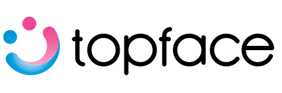
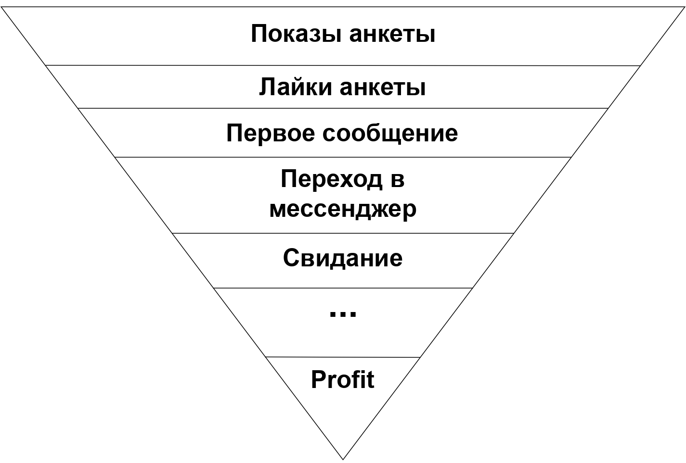

# Topface_ABtest
## Проект по проверке гипотезы об эффективности анкет в дейтинге Topface с помощью A/B тестирования

**TopFace** — это сайт знакомств и мобильное приложение для знакомств, которое предназначено для мэтчинга пользователей,
позволяя им отправлять сообщения свободно, если они получают «лайк»

## Описание проекта
С точки зрения продвинутого пользователя любой сайт знакомств - воронка

Ясно, что мы хотим сделать первые несколько этапов воронки насколько это возможно прямыми, чтобы иметь возможность выбирать.  
Мы можем влять на число показов покупая премиум, а на переход с показа на лайк мы можем влиять качеством анкеты - фотографиями и описанием.  
Бытует мнение, что описание анкеты пользователи не читают, а обращают внимание лишь на фотографии.  
Я решил это проверить, в связи с чем имеет место следующая

**Гипотеза:** *Подробное описание в анкете увеличивает эффективность анкеты на 10%*

**Метрика:** *Cреднее число симпатий в сутки*

### Описание экперимента:

Создается 2 анкеты одного и того же пользователя (с наличием его личного согласия на эксперимент) без подробного описания ‘о себе’ на которых проводится A/A тест, чтобы удостовериться, что нет дизбаланса в анкетах.

Затем создается 2 анкеты для A/B теста, где в первую анкету оставляем без описания, а вторую подробно заполняем.

Нулевая гипотеза $H_0$: наличие описания не увеличивает среднее число симпатий в сутки

Альтернативная гипотеза $H_1$: описание увеличивает среднее число симпатий в сутки

**A/A тест:** 

1. Устанавливаем геолокацию на центральны районы Москвы: Арбат и Мещанский
2. Регистрируем 2 анкеты с эмулятора Bluestacks с одинаковыми фотографиями
3. Ежедневно, 14 дней:
    - Фиксируем число лайков (likes), число гостей (guests) при входе в приложение
    - Лайкаем 20 анкет, дизлайкаем 10, пишем 3 сообщения
    - Фиксируем число лайков (post_likes), число гостей (post_guests) после активности
4. Создаем 2 датасета о числом лайков по дням для двух анкет
5. После 14 дней бутстрепом проверяем гипотезу $H_0$ о равенстве среднего числа лайков

**A/B тест:** 

1. Устанавливаем геолокацию на центральны районы Москвы: Арбат и Мещанский
2. Регистрируем 2 анкеты с эмулятора Bluestacks с одинаковыми фотографиями, где в первая анекта остается незаполненной, 
    а вторая - с подробным описанием
3. Ежедневно, 14 дней:
    - Фиксируем число лайков (likes), число гостей (guests) при входе в приложение
    - Лайкаем 20 анкет, дизлайкаем 10, пишем 3 сообщения
    - Фиксируем число лайков (post_likes), число гостей (post_guests) после активности
4. Создаем 2 датасета о числом лайков по дням для двух анкет
5. После 14 дней проверяем гипотезу $H_0$ о равенстве среднего числа лайков

## Результаты эксперимента:
- Гипотеза об эффективности описания в анкете отвергается
- Увеличение среднего числа лайков в сутки оказалось не статзначимо
- С помощью бутстреп распределения среднего числа лайков в день, показал, что имеет место смесь распределений (будние/выходные)
- Дальнейший статистический анализ нужно проводить с учетом смеси распределений
- Выяснил, что система искусственно нагоняет трафик ботов в первые дни регистрации
